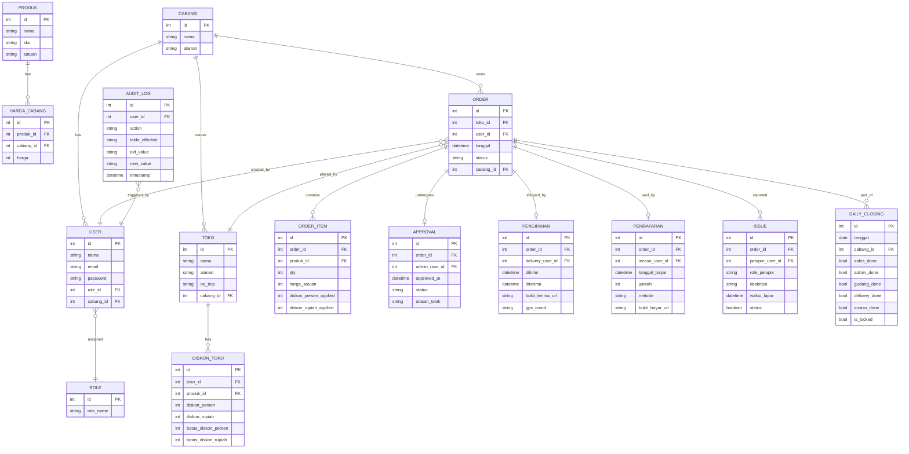

# PRD — Project Requirements Document

## 1. Overview
Sistem ini menggantikan Google Sheets yang rawan manipulasi dan tidak real‑time di distributor FMCG dengan 4 cabang (~45 karyawan). Tujuan utama: menghadirkan alur Order‑to‑Cash yang transparan, anti‑fraud, dan akuntabel. Setiap transaksi tercatat permanen, proses pengiriman dan pembayaran wajib dilengkapi bukti (foto/GPS), dan kendala di lapangan langsung terlihat di dashboard pemilik lewat laporan spontan dari gudang maupun incaso.  
Pemilik juga dapat memantau performa bisnis melalui dashboard yang menampilkan pendapatan hari ini dan perbandingannya dengan hari kemarin (naik/turun persentase), serta indikator peringatan dini bila ada masalah barang atau pembayaran.

## 2. Requirements

### Fungsional
- **Alur Order‑to‑Cash lengkap**: Input pesanan → Persetujuan faktur → Persiapan gudang → Pengiriman dengan bukti → Pelunasan (incaso).
- **Multi‑cabang & multi‑role**: 4 cabang independen, 45 user dengan peran Sales, Admin Fakturist, Gudang, Delivery, Incaso, dan Owner.
- **Harga otomatis per cabang dan per toko**: Sistem menerapkan harga dasar cabang + diskon khusus toko (diskon % dan Rp, keduanya bisa dibatasi maksimal).
- **Persetujuan dan printing terintegrasi**: Admin fakturis menyetujui order, lalu mencetak faktur & pick list; gudang mencetak rekap; incaso mencetak kwitansi.
- **Daily closing wajib per divisi**: Setiap akhir hari, semua divisi harus melakukan closing; jika tidak, notifikasi teguran muncul.
- **Laporan real‑time dan dashboard per role**: Status kerja, pending task, metrik bisnis, serta Traffic Light Alert.
- **Dashboard Owner ditingkatkan**:  
  - Tampilan pendapatan hari ini vs kemarin (rupiah dan persentase perubahan).  
  - Daftar laporan kendala dari gudang (barang kurang) dan incaso (selisih pembayaran) secara real‑time.
- **Immutable records**: Setelah daily closing, data pada tanggal tersebut tidak bisa diubah (lock tanggal) oleh siapa pun, termasuk admin.
- **Bukti upload hanya di Delivery & Incaso**: Delivery wajib unggah foto terima + GPS; Incaso wajib unggah bukti pembayaran.  
- **Laporan spontan dari lini operasional**: Gudang dapat mencatat temuan barang kurang saat menyiapkan order; Incaso dapat mencatat selisih/tidak balance saat pembayaran. Laporan ini langsung muncul sebagai alert di dashboard Owner/Manajer.
- **Audit trail penuh**: Setiap perubahan data (update, delete, print, closing) tercatat siapa, kapan, apa yang berubah.

### Non‑fungsional
- **PWA**: Dapat diakses via browser desktop/mobile, bisa diinstal di layar utama, bekerja offline‑terbatas (caching).
- **Responsif**: Tampilan optimal di perangkat genggam karena banyak user lapangan.
- **Keamanan**: Akses berbasis peran, autentikasi kuat, data terenkripsi, tidak ada akses langsung ke database oleh user biasa.
- **Anti‑fraud**: Validasi bertingkat, log tidak bisa dihapus, deteksi anomali (misal diskon melebihi batas).

## 3. Core Features
- **Manajemen Master Data**: Cabang, pengguna, peran, toko, produk, harga dasar cabang, diskon khusus toko (batas % dan Rp).
- **Order Entry (Sales)**: Pilih toko, input item dengan harga otomatis, diskon terbatas; tidak perlu unggah bukti.
- **Approval & Pencetakan Faktur (Admin Fakturist)**: Validasi order, terapkan diskon jika ada, kunci order, cetak faktur + pick list (PDF/template cetak).
- **Persiapan Gudang (Gudang)**: Lihat daftar pick list yang disetujui, konfirmasi barang siap, cetak rekap pengiriman. **Ada tombol “Laporkan Kendala”** untuk mencatat barang kurang saat persiapan.
- **Pengiriman (Delivery)**: Assign pesanan ke kurir, lacak status pengiriman, wajib unggah foto bukti terima & GPS.
- **Pelunasan / Incaso (Incaso)**: Catat pembayaran (tunai/transfer), unggah bukti pembayaran, cetak kwitansi. **Ada tombol “Laporkan Selisih”** bila jumlah yang diterima tidak sesuai.
- **Laporan Kendala (Gudang & Incaso)**: Data kendala tercatat per order, ditampilkan di dashboard Owner/Manajer sebagai daftar yang belum tertangani.
- **Daily Closing per Divisi**: Logika closing berurutan (sales tutup dulu, lalu admin, gudang, dst.), notifikasi jika belum closing.
- **Dashboard Real‑Time & Traffic Light Alert**: Owner melihat ringkasan seluruh cabang, indikator hijau/kuning/merah untuk performa harian, stok kritis, overdue payment, dll.
- **Dashboard Keuangan**: Kartu “Pendapatan Hari Ini” yang membandingkan total uang masuk (dari incaso) hari ini dengan kemarin, lengkap dengan persentase naik/turun.
- **Audit Trail & Immutable Log**: Log semua aksi kritis, ditampilkan di halaman khusus untuk owner/manajer.

## 4. User Flow
```mermaid
flowchart TB
    Start([Sales buka aplikasi]) --> A{Masukkan pesanan toko}
    A --> B[Sistem hitung harga otomatis]
    B --> C[Diskon %/Rp diterapkan, divalidasi batas]
    C --> D[Pesanan Pending]
    D --> E[Admin Fakturist lihat daftar pending]
    E --> F[Approve / tolak + beri alasan]
    F --> G[Cetak faktur & pick list]
    G --> H[Gudang lihat pick list disetujui]
    H --> I{Apakah barang kurang?}
    I -- Ya --> J[Laporkan kendala (barang kurang) ke dashboard]
    I -- Tidak --> K[Konfirmasi barang siap, cetak rekap]
    K --> L[Delivery ambil barang]
    L --> M[Kirim ke toko, unggah foto + GPS]
    M --> N[Status terkirim]
    N --> O[Incaso catat pembayaran]
    O --> P{Uang yang diterima sesuai?}
    P -- Tidak --> Q[Laporkan selisih ke dashboard]
    P -- Ya --> R[Unggah bukti bayar, cetak kwitansi]
    R --> S[Pesanan lunas]
    S --> T[End of day: daily closing per divisi]
    T --> U{Semua divisi sudah closing?}
    U -- Ya --> V[Data terkunci, tidak bisa diubah]
    U -- Tidak --> W[Notifikasi tegur divisi yang belum closing]
```

## 5. Architecture
```mermaid
sequenceDiagram
    participant Sales
    participant AdminF
    participant Gudang
    participant Delivery
    participant Incaso
    participant Sistem
    participant DB

    Sales->>Sistem: Input order (tanpa bukti)
    Sistem->>DB: Simpan order (status: pending_approval)
    AdminF->>Sistem: Lihat daftar pending
    AdminF->>Sistem: Validasi & approve/tolak
    Sistem->>DB: Update status: approved/rejected, catat approval
    AdminF->>Sistem: Cetak faktur
    Sistem-->>AdminF: Dokumen cetak (PDF/HTML)
    Gudang->>Sistem: Lihat approved list
    alt Barang kurang ditemukan
        Gudang->>Sistem: Laporkan kendala (deskripsi)
        Sistem->>DB: Simpan laporan (issue) – tampil di dashboard Owner
    else Normal
        Gudang->>Sistem: Konfirmasi siap + cetak rekap
        Sistem->>DB: Status: ready_to_ship
    end
    Delivery->>Sistem: Ambil order, kirim + unggah foto & GPS
    Sistem->>DB: Status: delivered, simpan bukti
    Incaso->>Sistem: Input pembayaran
    alt Jumlah tidak sesuai
        Incaso->>Sistem: Laporkan selisih (deskripsi)
        Sistem->>DB: Simpan laporan (issue) – tampil di dashboard Owner
    else Jumlah sesuai
        Incaso->>Sistem: Unggah bukti bayar
        Sistem->>DB: Status: paid, catat transaksi
    end
    Note over Sales,Incaso: Daily closing: tiap role lakukan closing; sistem kunci data per tanggal
    Sistem->>DB: Lock flag untuk tanggal tsb.
```

## 6. Database Schema


## 7. Tech Stack
- **Frontend & Backend**: Next.js (App Router) – satu kode untuk server dan UI.
- **Styling & Komponen**: Tailwind CSS + shadcn/ui, responsif mobile‑friendly.
- **Database**: SQLite (file‑based), dengan Drizzle ORM untuk query type‑safe.
- **Autentikasi & Otorisasi**: Better Auth – mendukung multi‑role dan proteksi rute.
- **PWA**: Konfigurasi next‑pwa (workbox) agar aplikasi bisa diinstal dan meng‑cache aset penting.
- **Pencetakan**: Gunakan @react‑pdf/renderer untuk menghasilkan faktur, kwitansi, rekap dalam format PDF langsung dari data.
- **Upload Bukti**: Penyimpanan lokal (file system) atau folder `public` (opsi sederhana), integrasi dengan input file.
- **Offline Caching**: Service worker untuk caching data yang sering diakses (opsional).

## 8. Spesifikasi Desain (Anti AI‑Slop)
Tujuan: tampilan terasa **benar‑benar dirancang**, bukan default generik AI. Default yang paling sering muncul dari AI dan **WAJIB DIHINDARI**: primary biru/indigo (blue‑500 → indigo‑600), font Inter/Roboto untuk segalanya, kartu rounded seragam ber‑border kiri, gradient ungu‑biru, dan emoji sebagai ikon. Pakai token spesifik di bawah ini.

### 8.1 Identitas Visual
- **Karakter**: tegas, padat data, "operations console" — bukan landing page SaaS. Mengutamakan keterbacaan cepat di lapangan & density tinggi untuk owner.
- **Mode**: dukung light & dark; default light untuk lapangan (kontras tinggi di bawah matahari), dark opsional untuk owner.

### 8.2 Tipografi
- **Heading / angka penting**: `Space Grotesk` atau `Geist` (berkarakter, bukan Inter/Roboto).
- **Body / tabel**: `IBM Plex Sans` — netral tapi punya identitas, sangat terbaca pada ukuran kecil.
- **Angka uang & metrik**: gunakan **tabular‑nums** + monospace `JetBrains Mono` agar kolom rupiah rata.
- **Skala tegas (bukan rata)**: 12 / 14 / 16 / 20 / 28 / 40 px. Weight berani: 400 body, 600 label, 700–800 angka KPI.

### 8.3 Warna (token OKLCH, hierarki 60‑30‑10)
- **Netral dominan (60%)**: `--bg: oklch(0.98 0.005 95)` (kertas hangat, bukan putih murni), `--surface: oklch(0.96 0.006 95)`, teks `--ink: oklch(0.22 0.02 260)`.
- **Brand sekunder (30%)**: hijau tua kemasan FMCG — `--brand: oklch(0.52 0.12 155)` (deep green, **bukan** biru/indigo).
- **Aksen aksi (10%)**: amber/oranye hangat — `--accent: oklch(0.72 0.16 65)` untuk CTA & highlight.
- **Status semantik (Traffic Light)**:
  - Critical/merah: `oklch(0.58 0.20 25)`
  - Warning/kuning: `oklch(0.80 0.15 85)`
  - OK/hijau: `oklch(0.62 0.14 150)`
- Hindari palet pucat seragam: status harus **menonjol** di antara netral.

### 8.4 Spacing, Radius, Border
- **Skala spacing** kelipatan 4: 4 / 8 / 12 / 16 / 24 / 32.
- **Radius**: kecil & konsisten (6px komponen, 10px kartu) — hindari "pill" rounded berlebihan di semua elemen.
- **Border**: 1px `oklch(0.90 0.01 95)`; gunakan garis pemisah tipis ketimbang shadow tebal (estetika console).
- **Elevasi**: shadow halus & rendah, hanya untuk overlay/modal — bukan di setiap kartu.

### 8.5 Motion
- Durasi pendek 120–200ms, easing `cubic-bezier(0.2, 0, 0, 1)`.
- Animasi fungsional saja: feedback tekan tombol, masuk‑keluar toast/alert, perubahan angka KPI (count‑up halus). **Tanpa** animasi dekoratif berat.
- Hormati `prefers-reduced-motion`.

### 8.6 Komponen Kunci
- **KPI Card (Pendapatan Hari Ini)**: angka besar tabular, delta vs kemarin dengan panah ▲/▼ + warna semantik + persentase. Tanpa gradient.
- **Traffic Light Alert List**: tiap item = badge level (Critical/Warning), judul tebal, timestamp relatif ("8 menit lalu"), deskripsi 1–2 baris, garis aksen kiri sesuai level. Urut by severity lalu waktu.
- **Tabel padat**: zebra halus, header sticky, kolom angka rata kanan tabular‑nums, baris cukup tinggi untuk disentuh (min 44px) di mobile.
- **Status Pill**: warna semantik konsisten lintas modul (pending, approved, ready, delivered, paid, locked).
- **Tombol lapor kendala/selisih**: aksen oranye, jelas & besar di area kerja gudang/incaso.

### 8.7 Responsif & Density
- **Lapangan (Sales/Delivery, mobile‑first)**: layout 1 kolom, target sentuh besar, tombol utama sticky bawah.
- **Owner/Fakturist (desktop/tablet)**: density tinggi, multi‑kolom, tabel & dashboard kaya.
- Breakpoint: 360 / 768 / 1024 / 1440.

### 8.8 Aksesibilitas
- Kontras teks ≥ 4.5:1; status tidak hanya dibedakan warna (selalu ada ikon/label).
- Fokus keyboard terlihat; target sentuh ≥ 44px.

## 9. Tech Stack
*(lihat bagian di atas — diringkas: Next.js + Tailwind + shadcn/ui + SQLite/Drizzle + Better Auth + next‑pwa + @react‑pdf/renderer)*
## 10. Modul Kanvas Luar Kota (Addendum)

Di luar ER diagram §6, sistem memiliki modul kanvas luar kota:

- **Trip kanvas** (`trip_kanvas`, `trip_item`): sales memuat barang sekali ke kendaraan, gudang mengonfirmasi muat, sales berkeliling beberapa hari, lalu gudang memverifikasi rekonsiliasi (muat = terjual + kembali). Status: `diajukan → berjalan → rekonsiliasi → selesai`.
- **Faktur kanvas**: order dengan `tipe='kanvas'` terbit langsung di toko berstatus `delivered` tanpa approval admin. Kontrol pengganti: harga/diskon tervalidasi server (priceOrderLines) dan qty dibatasi sisa muatan trip.
- **Kirim via WhatsApp**: faktur PDF dikirim dari HP sales (Web Share API; fallback link `wa.me` + URL publik ber-token `/f/[share_token]`). Tidak ada gateway WA server.
- **Pembayaran**: tunai dicatat sales di tempat; tempo masuk antrean Incaso seperti order biasa.
